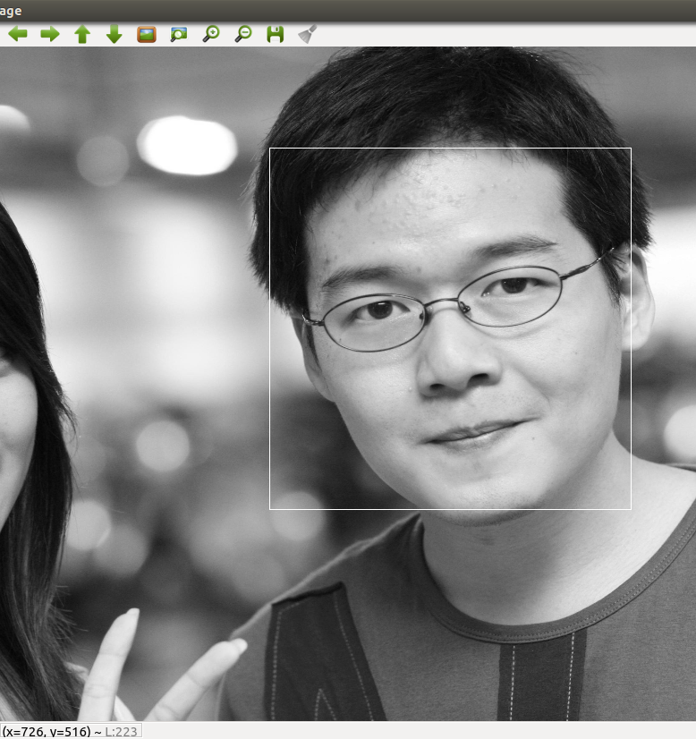

# face alignment at 3000fps
It is an implementation of Face Alignment at 3000fps via Local Binary Features, a paper on CVPR 2014
#How To Use
```
mkdir release
cp CMakeList.txt ./release
cd release
cmake .
make
./application train ModelName # when training
./application test ModelName # when testing 
./application test ModelName imageName # when testing one image
```

# Notes
    you should change some image PATH in main.cpp and utils.cpp(function LoadImages) for correctly running the program.
    I use the opencv face detection method, you can change to what you like, as long as using the same face detector in training and testing
    it can both run under Windows and Unix-like systems.
    it can reach 100~200 fps(even faster) on a single i7 core when the model is 5 or 6 layers deep,

# Results Image:
###1. first use the mean shape for initial shape:

###2. detect the face

###3. predict the face landmarks by refine the initial shape


# Future Development
	I have add up the openMP to use multithread for faster training, it is really fast, takes an hour when the model is 5 layers deep and 10 trees in each forest with about 8000+ augmented images.
    I have already develop the multithread one, but the time for predicting one image is slower than sequential one, since creating and destroying threads cost more time.
    I will optimize it and update it later.
    Second, I will also develop a version on GPU, and will also upload later.

if you have any question, contact me at declanxu@gmail.com or declanxu@126.com, THANKS.
