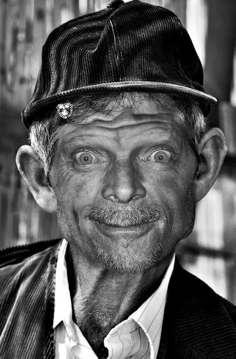

# Face Alignment at 3000fps
It is an implementation of [Face Alignment at 3000fps via Local Binary Features](http://research.microsoft.com/en-US/people/yichenw/cvpr14_facealignment.pdf), a paper on CVPR 2014

## New!!! Refactoring the code
### 1. Add Validation in Training Step(error is the same to the paper)
add Validation after each stage, output will be like below, now we can see how our model is fit on the validation set, much easier for parameter tuning.(Following is the output when training Helen dataset)，the trained model can be **DOWNLOADED** from **[HERE](http://pan.baidu.com/s/1eRspt2U)**, see next section for how to use.
```
training stage: 0 of 6
train regression error: 836.521, mean error: 0.116767
Validation at stage: 0
Validation error: 29.7611, mean error: 0.095695

training stage: 1 of 6
train regression error: 533.649, mean error: 0.0744904
Validation at stage: 1
Validation error: 22.4096, mean error: 0.0720567

training stage: 2 of 6
train regression error: 386.907, mean error: 0.0540071
Validation at stage: 2
Validation error: 19.6509, mean error: 0.0631862

training stage: 3 of 6
train regression error: 297.455, mean error: 0.0415208
Validation at stage: 3
Validation error: 18.3068, mean error: 0.0588642

training stage: 4 of 6
train regression error: 247.068, mean error: 0.0344875
Validation at stage: 4
Validation error: 17.8339, mean error: 0.0573436

training stage: 5 of 6
train regression error: 207.739, mean error: 0.0289976
Validation at stage: 5
Validation error: 17.5538, mean error: 0.0564431
```
### 2. Change to Read Parameters from Configure File
See next section for details.

In pervious versions, when setting the parameters, we have to write hard code in main.cpp, now I changed it to read from a configure file without having to recompile the codes

### 3. Add Helen Dataset Example for Better Understanding
in the `example` folder, there are some configure files. See next section for details.

## Interpret the Paper's details 
If you are a Chinese, you can go to my blog for more details. [link](http://freesouls.github.io/2015/06/07/face-alignment-local-binary-feature/)

## License
If you use my work, please cite my name (Binbin Xu), Thanks in advance.
This project is released under the BSD 2-Clause license.

##How To Use
### Requirements:
- OpenCV(I just use the basic structures of OpenCV, like cv::Mat, cv::Point)
- cmake

### Prepare: 
- Download helen dataset from this [link: Helen Dataset](http://ibug.doc.ic.ac.uk/resources/facial-point-annotations/)
- unzip the helen dataset and put it under `example` folder, the path will be like `example/helen/trainset/***.jpg` for an image

### Training 
```
mkdir build
cd build
cmake ..
make
./application train ../example/helen_train_config.txt
```
the training starts, you just need to see the output

### Testing
- testing images that have ground truth shapes

take helen testset for example.
```
./application test ../example/helen_test_config_images_with_ground_truth.txt
```

- testing images that do not have ground truth shapes

take helen testset for example, assuming that we do not known the landmarks' annotations. 
```
./application test ../example/helen_test_config_images_without_ground_truth.txt
```

### Using My Simple Model
if you do not want to train a model, I provide one. You can download a model trained on `helen/trainset` images from **[HERE](http://pan.baidu.com/s/1eRspt2U)**, test error is `0.0564244` on `helen/testset`

- download `helen_trained_model.zip` and unzip it to `example/`

path will be `example/helen_trained_model/helenModel_params.txt` for `helenModel_params.txt`

- in `example/helen_test_config_images_with_ground_truth.txt`

change first line `helenModel` to `../example/helen_trained_model/helenModel`

- run the following command

```
./application test ../example/helen_test_config_images_with_ground_truth.txt
```

- actually, you can put the model wherever you want, just change the path accordingly in `configure file`

##Configure Files Explanation:
###1. Image List
in `example/` there is a file named `helen_test_images_list_with_ground_truth.txt`, the content is like this:
```
2815405614_1.jpg 2815405614_1.pts
114530171_1.jpg 114530171_1.pts
2437904540_1.jpg 2437904540_1.pts
...
```
each line contains a pair of names, the first one is the image name, the second is the ground truth file name

in `example/` there is a file named `helen_test_images_list_without_ground_truth.txt`, the content is like this:
```
2815405614_1.jpg
114530171_1.jpg
2437904540_1.jpg
...
```
after we trained a new model, we want to test new images, so just put each image's name in the image_list.txt

###2. Training Configure File
```
helenModel  // the model name, name what you like
200         // params.local_features_num_ = 200;
68          // params.landmarks_num_per_face_ = 68;
6           // params.regressor_stages_ = 6;
5           // params.tree_depth_ = 5;
12          // params.trees_num_per_forest_ = 12;
3           // params.initial_guess_ = 5;
0.3         // params.overlap_ = 0.3;
0.29        // first stage lacal radius when samples the pixel difference feature positions
0.21        // second stage local radius 
0.16
0.12
0.08
0.04        // sixth stage local radius
2           // number of datasets for training
../example/helen/trainset/                      // root folder that contains the *.jpgs and *.pts of the first dataset
../example/helen_train_images_list.txt          // images list of the first dataset
../example/otherdataset/                        // root folder of the second dataset
../example/otherdatset_train_images_list.txt    // images list of the second dataset
1                                               // number of datasets for validation
../example/helen/testset/                       // root folder that contains the *.jpgs and *.pts
../example/helen_test_images_list_with_ground_truth.txt // images list
```
When training, this configure file will be parsed, and images will be loaded. You can refer to `main.cpp` for details how the configure file is parsed.

the parameters setting above is just an example, you have to fine tune the parameters in training for your dataset.

off course, you can still set the parameters like this directly in `main.cpp`. 
```
Parameters params;
params.local_features_num_ = 300;
params.landmarks_num_per_face_ = 68;
params.regressor_stages_ = 6;
params.local_radius_by_stage_.push_back(0.4);
params.local_radius_by_stage_.push_back(0.3);
params.local_radius_by_stage_.push_back(0.2);
params.local_radius_by_stage_.push_back(0.1);
params.local_radius_by_stage_.push_back(0.08);
params.local_radius_by_stage_.push_back(0.05);
params.tree_depth_ = 5;
params.trees_num_per_forest_ = 8;
params.initial_guess_ = 5;
```

###3. Test Configure File
`helen_test_config_images_with_ground_truth.txt`
```
helenModel      // model name that we want to use after we have trained
1               // 1 means we know the ground_truth_shapes of the images
1               // number of datasets we want to be tested
../example/helen/testset/   // root folder for testset
../example/helen_test_images_list_with_ground_truth.txt // image list
```

`helen_test_config_images_without_ground_truth.txt`
```
helenModel      // model name that we want to use after we have trained
0               // 0 means we do not know the ground_truth_shapes of the images
1               // number of datasets we want to be tested
../example/helen/testset/   // root folder for testset
../example/helen_test_images_list_without_ground_truth.txt // image list
```

## Notes
### 1. overlap
there is a parameter in `randomforest.cpp`, line 95: 

```
double overlap = 0.3; // you can set it to 0.4, 0.25 etc
```
each tree in the forest will be constructed using about **`N*(1-overlap+overlap/T)`** examples, where `N` is the total number of images after augmentation(if your train data set size is 2000, and `initial_guess_` is 5, then N = 2000*(5+1)=12000 images), `T` is the number of trees in each forest.
### 2. what are .pts files
[here](http://ibug.doc.ic.ac.uk/resources/facial-point-annotations/) you can download dataset with .pts files, each .pts file contains 68 landmarks positions of each face

### 3. what are BoundingBox
it is just the bounding box of a face, including the center point of the box, you can just use the face rectangle detected by opencv alogrithm with a little effort calculating the center point's position yourself. Example codes are like below
``` c++
BoundingBox bbox;
bbox.start_x = faceRec.x; // faceRec is a cv::Rect, containing the rectangle of the face
bbox.start_y = faceRec.y;
bbox.width = faceRec.width;
bbox.height = faceRec.height;
bbox.center_x = bbox.start_x + bbox.width / 2.0;
bbox.center_y = bbox.start_y + bbox.height / 2.0;
bboxes.push_back(bbox);
```

### 4. resize the image
If you try to resize the images, please use the codes below
``` c++
if (image.cols > 2000){
    cv::resize(image, image, cv::Size(image.cols / 3, image.rows / 3), 0, 0, cv::INTER_LINEAR);
    ground_truth_shape /= 3.0;
}
```
DO NOT SWAP "image.cols" and "image.rows", since "image.cols" is the width of the image, the following lines are WRONG!!!
``` c++
if (image.cols > 2000){
    cv::resize(image, image, cv::Size(image.rows / 3, image.cols / 3), 0, 0, cv::INTER_LINEAR);
    ground_truth_shape /= 3.0;
}
```

### 5. Customize
Re-write `LoadGroundTruthShape` and `LoadImages` in `utils.cpp` for your own needs since different dataset may have different data format.


## Results:
### 1. Detect The Face

### 2. Use The Mean Shape As The Initial Shape:

### 3. Predict The Landmarks

### 4. Bad Case


when you test new images that do not have ground truth annotations, you may encounter problems like this, actually it is **NOT** Face Alignment's problem, for the code just uses OpenCV's default face detector, and I choose the first bounding box rectangle returned by OpenCV(line 345 in `utils.cpp`: `cv::Rect faceRec = faces[0];`), you can use all the bounding box by re-writing the function. And sometimes the face detector may fail to detect a face in the image.

# More
- The paper claims for 3000fps for very high frame rates for different parameters, while my implementation can achieve several hundreds frame rates. What you should be AWARE of is that we both just CALCULATE the time that predicting the landmarks, EXCLUDES the time that detecting faces.
- If you want to use it for realtime videos, using OpenCV's face detector will achieve about 15fps, since 80% (even more time is used to get the bounding boxes of the faces in an image), so the bottleneck is the speed of face detection, not the speed of landmarks predicting. You are required to find a fast face detector(For example, [libfacedetection](https://github.com/ShiqiYu/libfacedetection))
- In my project, I use the opencv face detector, you can change to what you like as long as using the same face detector in training and testing
- it can both run under Windows(use 64bits for large datasets, 32bits may encounter memory problem) and Unix-like(preferred) systems.
- it can reach 100~200 fps(even 300fps+, depending on the model complexity) when predicting 68 landmarks on a single i7 core with the model 5 or 6 layers deep. The speed will be much faster when you reduce 68 landmarks to 29, since it uses less(for example, only 1/4 in Global Regression, if you fix the random forest parameteres) parameters.
- for a 68 landmarks model, the trained model file(storing all the parameters) will be around 150M, while it is 40M for a 29 landmarks model. 
- the results of the model is acceptable for me, deeper and larger random forest(you can change parameters like tree_depth, trees_num_per_forest_ and so on) will lead to better results, but with lower speed. 


# ToDo
- data augmentation like `flip` and `rotate` the images.
- go on training after loading a trained model(currently we have to re-run the previous stages when we want to train a deeper model with the same parameter setting as a already trained model)
- I have already develop the multithread one, but the time for predicting one image is slower than sequential one, since creating and destroying threads cost more time, I will optimize it and update it later.
- I will also develop a version on GPU, and will also upload later.

# THANKS
Many thanks goes to those appreciate my work.

if you have any question, contact me at declanxu@gmail.com or declanxu@126.com, THANKS.
